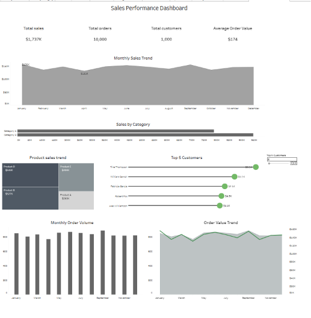

# Sales Performance Dashboard

Interactive Tableau dashboard for analysing sales performance, customer behaviour, product contribution, category performance, and monthly business trends.

[View Interactive Tableau Dashboard](https://public.tableau.com/views/Sales_17834338055250/Dashboard1?:language=en-US&:sid=&:redirect=auth&:display_count=n&:origin=viz_share_link)  
[Read the Full Business Analytics Report](sales-performance-dashboard-report.pdf)

## Project Overview

The project provides an executive-level overview of sales performance and demonstrates how interactive data visualisation can support business decision-making.

The dashboard combines KPI monitoring, monthly trend analysis, product and category analysis, customer ranking, and order volume analysis within a single analytical interface.

## Business Questions

The analysis was designed to answer the following questions:

- What is the overall sales performance of the business?
- How do sales and order volume change throughout the year?
- Which products and categories generate the highest revenue?
- Who are the highest-value customers?
- Is the business dependent on a small number of customers?
- What opportunities exist for improving sales and customer retention?

## Key Metrics

- Total Sales: approximately $1.737M
- Total Orders: 10,000
- Total Customers: 1,000
- Average Order Value: approximately $174
- Average Orders per Customer: 10

## Key Insights

- Monthly sales remain relatively stable, ranging from approximately $130.7K to $156.3K.
- Category 2 generates around 54% of total revenue and outperforms Category 1.
- Products D and B jointly contribute approximately 62% of total sales.
- Customers demonstrate repeat purchasing behaviour, averaging approximately 10 orders per customer.
- The Top 5 customers contribute only around 1.4% of total sales, indicating a diversified customer base and limited customer concentration risk.
- Product-level revenue is more concentrated than customer-level revenue.

## Business Recommendations

- Add gross profit and profit margin analysis by product and category.
- Introduce year-over-year comparisons and performance targets.
- Monitor customer lifetime value, retention, and repeat purchase rate.
- Apply RFM segmentation for more accurate customer prioritisation.
- Add sales forecasting and performance alerts.
- Investigate the profitability and growth potential of lower-performing products.

## Dashboard Features

- Executive KPI cards
- Monthly sales trend analysis
- Monthly order volume analysis
- Product revenue treemap
- Category performance comparison
- Dynamic Top N customer parameter
- Interactive Tableau filters

## Tools Used

- Tableau Public
- Data visualisation
- Business analytics
- KPI analysis
- Customer analysis
- Product and category analysis

## Project Files

- [Interactive Tableau Dashboard](https://public.tableau.com/views/Sales_17834338055250/Dashboard1?:language=en-US&:sid=&:redirect=auth&:display_count=n&:origin=viz_share_link)
- [Business Analytics Report](sales-performance-dashboard-report.pdf)

## Author

**Nataliia Rak**  
Data Analyst | Business Intelligence Analyst

[Tableau Public Profile](https://public.tableau.com/app/profile/nataliia.rak/vizzes)
